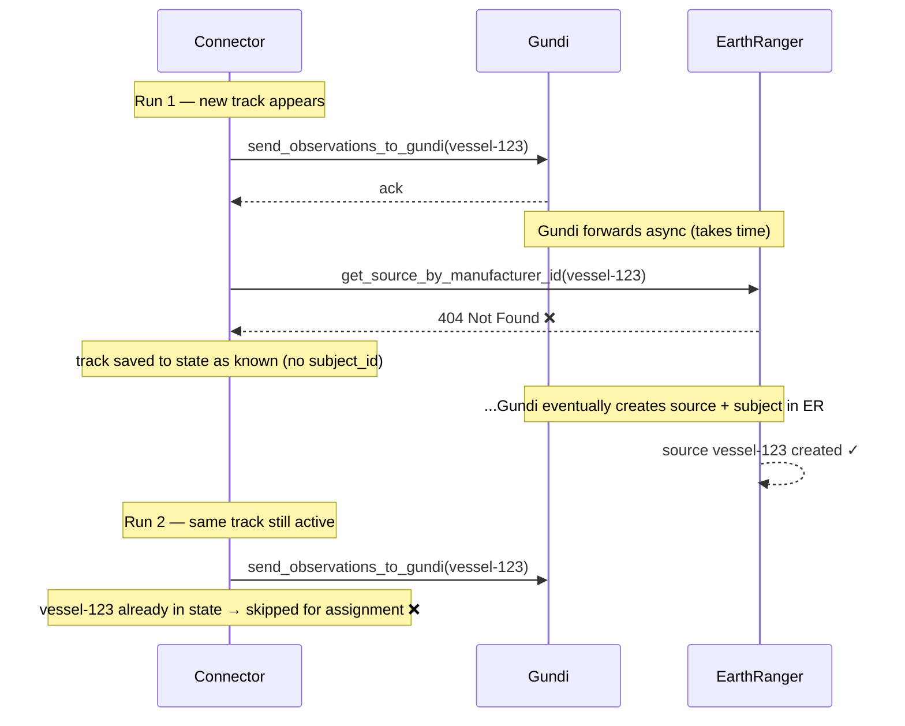

# Plan: Remove earthranger_base_url/token + Add Subject Group Assignment

## Status: COMPLETED (2026-03-13) — branch `plan/er-config-removal-subject-group`, commit `8842de3`

---

## Context

`PullVesselTrackingConfiguration` previously stored `earthranger_base_url` and `earthranger_token` — these were wrong because the destination's URL and auth token are already stored on the destination's `Integration` record in the platform (`base_url` + `auth` action config with `token`). Additionally, a new feature was needed: when a vessel track is seen for the first time, the corresponding EarthRanger subject should be assigned to a configured subject group.

This work spanned two repos:
- **gundi-integration-marinemonitor** (this repo) — main connector changes
- **er-client** (https://github.com/PADAS/er-client) — add `add_subjects_to_subjectgroup` to `AsyncERClient`

---

## What Was Done

### Repo 1: er-client

**File: `erclient/client.py`**

Added `add_subjects_to_subjectgroup` to `AsyncERClient`:

```python
async def add_subjects_to_subjectgroup(self, group_id, subjects):
    self.logger.debug(f'Adding subjects to subjectgroup {group_id}: {subjects}')
    return await self._post(f'subjectgroup/{group_id}/subjects/', payload=subjects)
```

> Note: The original plan proposed `patch_subjectgroup` using `PATCH /subjectgroup/{id}`. This was changed to `add_subjects_to_subjectgroup` using `POST /subjectgroup/{group_id}/subjects/` with a list payload, which is the correct ER API endpoint.

**File: `tests/async_client/test_add_subjects_to_subjectgroup.py`** (new)

5 tests: success, not_found, bad_credentials, permission_denied, internal_error.

---

### Repo 2: gundi-integration-marinemonitor

**`app/actions/configurations.py`**
- Removed `earthranger_base_url`, `earthranger_token`, `deactivate_subjects_auto`
- Added `earthranger_subject_group_name: Optional[str]` — human-readable group name (DAS does get_or_create by name)

**`app/actions/handlers.py`**
- ER credentials now fetched at runtime via `GundiClient.get_connection_details()` → `get_integration_details()` → `get_action_config("auth")`
- Observations posted directly to EarthRanger via `AsyncERClient.post_sensor_observation()` (generic sensor handler), bypassing `send_observations_to_gundi` — this supports `subject_groups` in the payload for group assignment at creation time
- `_assign_new_subjects_to_group()` was considered but not implemented — group assignment is handled by the sensor handler payload instead
- `deactivate_subjects_auto` removed — deactivation always runs
- Source prefix changed from `marinemonitor-` to `vessel-`

**`app/actions/tests/conftest.py`** and **`test_handlers.py`**
- Updated to remove old config fields, add GundiClient and AsyncERClient mocks
- Tests assert `subject_groups` in ER payload when group name is configured

**Other changes:**
- `requirements.txt` — removed `pyjq==2.6.0` (unused, incompatible with Python 3.14)
- `local/docker-compose.yml` — mounted `../../er-client:/er-client`, installs it as editable on startup
- `README.md` — complete rewrite with connector description, configuration table, observation schema, ER behavior, state management, local dev setup, registration instructions
- `local/.env.local` — added `INTEGRATION_TYPE_SLUG=marine_monitor`, `INTEGRATION_SERVICE_URL`, removed all quotes from values
- `.vscode/tasks.json` — added "Register integration (Docker)" VS Code task

---

## Known Issue: Subject Group Assignment Timing

Subject group assignment currently fails on first run because ER sources don't exist yet when we look them up immediately after sending observations to Gundi.

**Root cause:** `send_observations_to_gundi` sends to Gundi, which asynchronously forwards to ER. We immediately call ER to look up the source by `manufacturer_id`, but ER hasn't processed it yet → 404. The track is then saved to state as "known" with no `subject_id`. Future runs treat it as already-known and skip assignment.



**Resolution:** Retry logic implemented — on each run, known tracks missing a cached `subject_id` are retried. Confirmed working via logs: `Retry succeeded: ... confirms ER timing delay`.

---

## New Issue: Subjects Remain in Default Subject Group

**Observed:** After a successful retry, subjects end up in two groups — the configured group (`earthranger_subject_group_id`) and the site's default subject group (where operators don't want to see vessel tracks).

**Root cause:** When Gundi creates a subject in ER, ER automatically adds it to the site's default subject group. Our connector only adds to the configured group; it never removes from the default.

### What needs to be figured out

1. **Which ER API call removes a subject from a subject group?**
   - Likely `DELETE /api/v1.0/subjectgroup/{group_id}/subjects/` with a list payload, but needs to be confirmed and added to `er-client` as `remove_subjects_from_subjectgroup`

2. **Which subject group is the default?**
   - It is configurable per ER site — cannot be hardcoded. Options:
     - Add a second config field `earthranger_default_subject_group_id` so the operator provides it explicitly
     - Query ER for subject groups the subject already belongs to and remove from all except the configured one

3. **Permission risks — integration prerequisites for the playbook:**
   - The Gundi ER token must have **edit permission on the default subject group** — this is not guaranteed and may require a site admin to grant it explicitly
   - The Gundi ER token must have **edit permission on the configured subject group** — same risk
   - If either permission is missing, the operation will fail silently (or loudly) and the subject will remain in the wrong group
   - These should be documented as **prerequisites** in the integration setup playbook before go-live on any new ER site

---

## Pending

- [ ] Confirm ER API endpoint for removing subjects from a subject group
- [ ] Add `remove_subjects_from_subjectgroup` to `er-client`
- [ ] Decide how to identify the default subject group (explicit config field vs. query-and-remove)
- [ ] Implement removal from default group after successful assignment
- [ ] Document ER token permission requirements in a setup playbook
- [ ] Update tests to reflect all implementation changes (deferred until ready to push to GitHub)
- [ ] Merge PR #2 into `main` once above items are resolved and tests pass
